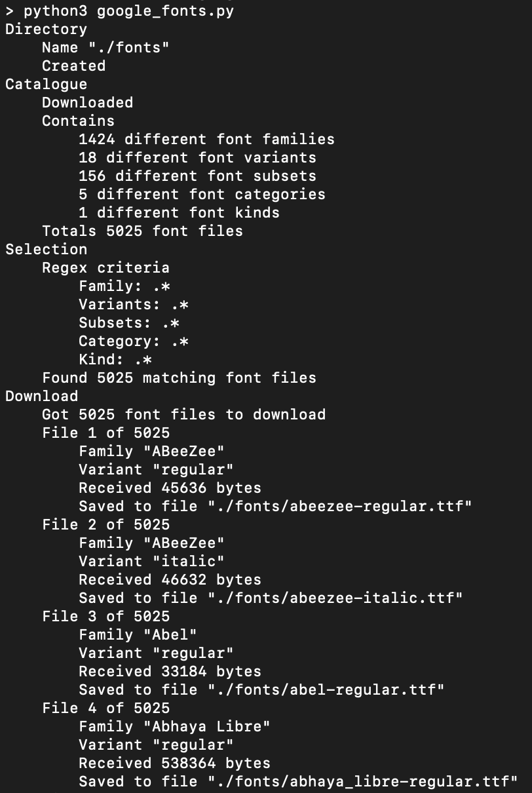
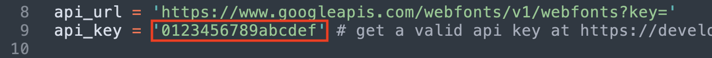
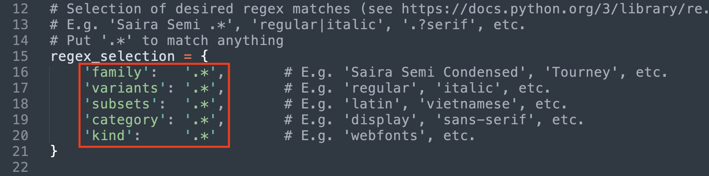
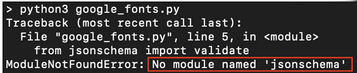
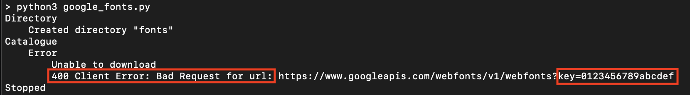
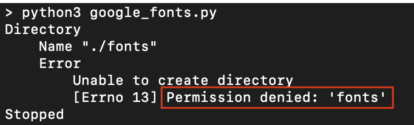

# Google fonts

Google fonts allows for regex granular selection and sequential downloading of the fonts hosted on [Google Fonts](https://fonts.google.com):



Notes:

- If you're simply looking to download all fonts, Google has you covered: https://github.com/google/fonts/archive/main.zip (warning: file weights more than 600MB).
- As of June 2022, there are 1424 different fonts available, contained in 5025 different font files.
- This script can be interrupted and resumed at any time.

## Prerequisites

### Additional modules

The following additional python modules are required:

- jsonschema

Installation with pip:

```
pip3 install jsonschema
```

### API key

A valid API key is required to download the fonts.

Log in to https://developers.google.com/fonts/docs/developer_api with your Google account and request an api key.

### Directory permissions

Verify that you have sufficient permissions to create a directory in the current working directory.

## Usage

1. Get a valid Google fonts API key. See previous section [API key](#api-key).

2. Make sure you have sufficient permissions. See previous section [Directory permissions](#directory-permissions).

3. Edit the file "google_fonts.py" and replace the content of the variable "api_key" (code line 9) with your API key:



4. Edit the file google_fonts.py and replace the content of variable "regex_selection" (code line 15) with your selection of expected regex matches:



5. Run the script:

```
python3 google_fonts.py
```

6. The resulting downloaded fonts will be stored in the directory "fonts".

Note: interrupt with ```Ctrl-c``` and resume with ```python3 google_fonts.py``` at will.

## Troubleshooting

Usual suspects:

### Modules

Symptom:



Cause: missing python module.

Solution: follow step described in previous section [Additional modules](#additional-modules).

### API

Symptom:



Cause: missing or incorrect Google font API key.

Solution: follow step 1 from the previous section [Usage](#usage).

### Permissions

Symptom:



Cause: insufficient permissions on the working directory.

Solution: set the necessary permissions to the current working directory.

## Contributing

All contributions are welcome.

## License

This project is licensed under the [GNU General Public License v3.0](https://spdx.org/licenses/GPL-3.0-or-later.html).

See file [LICENSE.txt](LICENSE.txt) for details.
